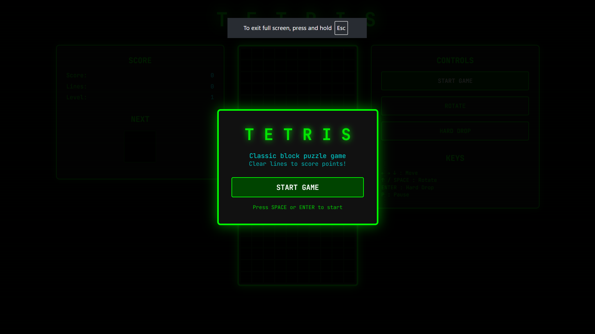
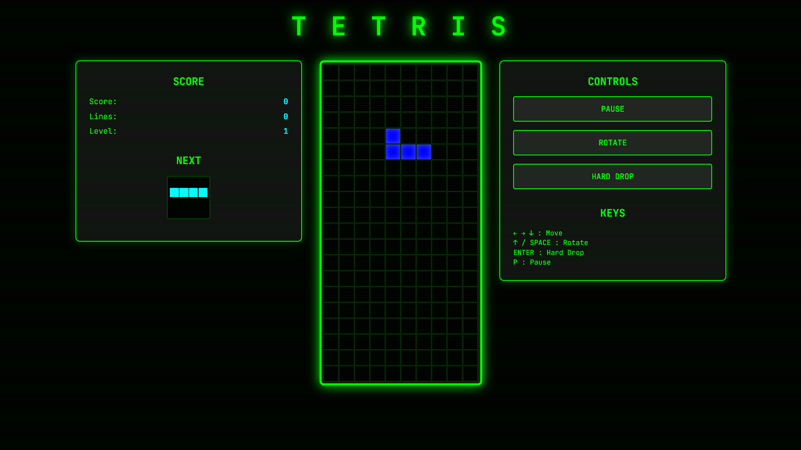

# 🎮 Retro Tetris

A **retro-inspired Tetris clone** with vintage CRT vibes.  
Built completely from scratch using **HTML, CSS, and JavaScript**.  


---

<!-- 🎥 Gameplay GIF -->


---


---

## 🎯 Features
✅ Classic **Tetris gameplay** (rotate, move, drop blocks)  
✅ **Score system** — earn points for every cleared line  
✅ Increasing **speed & difficulty** as you progress  
✅ Retro **CRT-inspired design** for a vintage arcade feel  
✅ Playable on any modern web browser  

---

## 🎮 Controls
| Key            | Action              |
|----------------|---------------------|
| ⬅️ / ➡️       | Move left / right   |
| ⬆️             | Rotate piece        |
| ⬇️             | Soft drop           |
| ⏎ (Enter)      | Hard drop           |
| P              | Pause / Resume      |

---

## 📸 Here is the samples
<p align="center">
  
  
</p>

---

## 🛠️ Installation
Clone the repo and run locally:

```bash
git clone https://github.com/Chetu002coder/Tetris-game.git
cd Tetris-game
